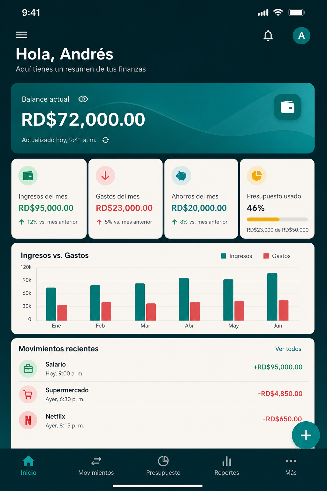
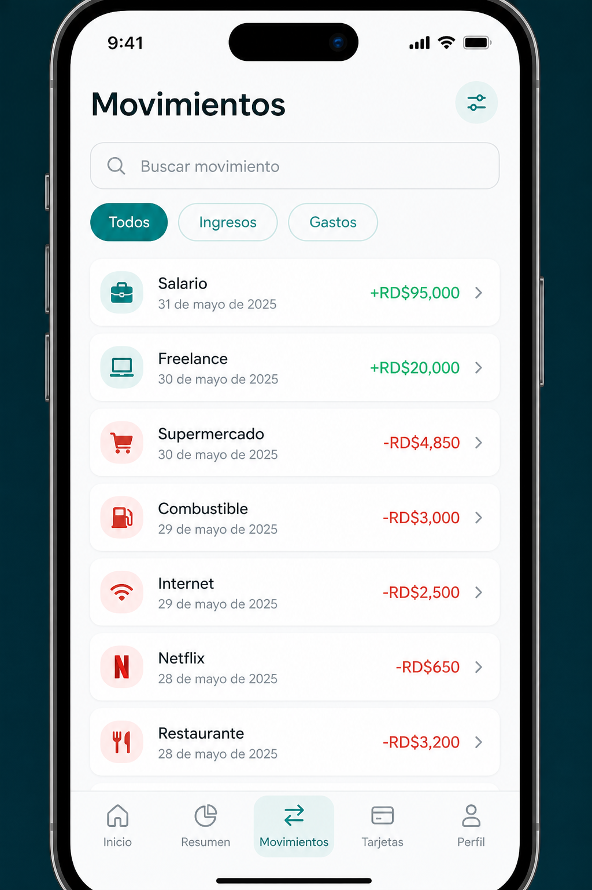
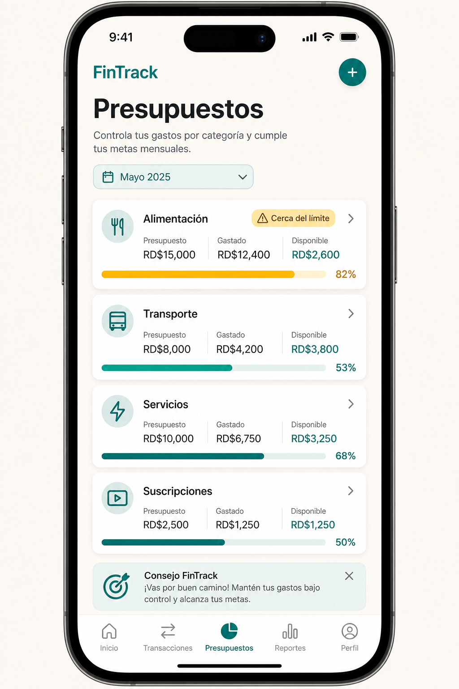
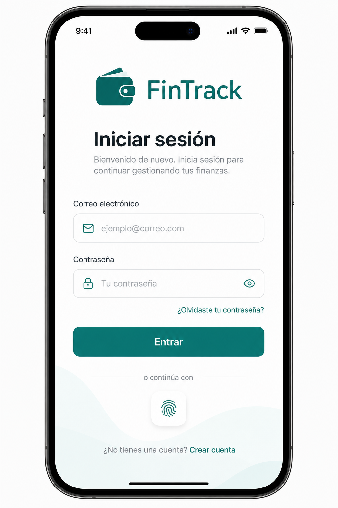
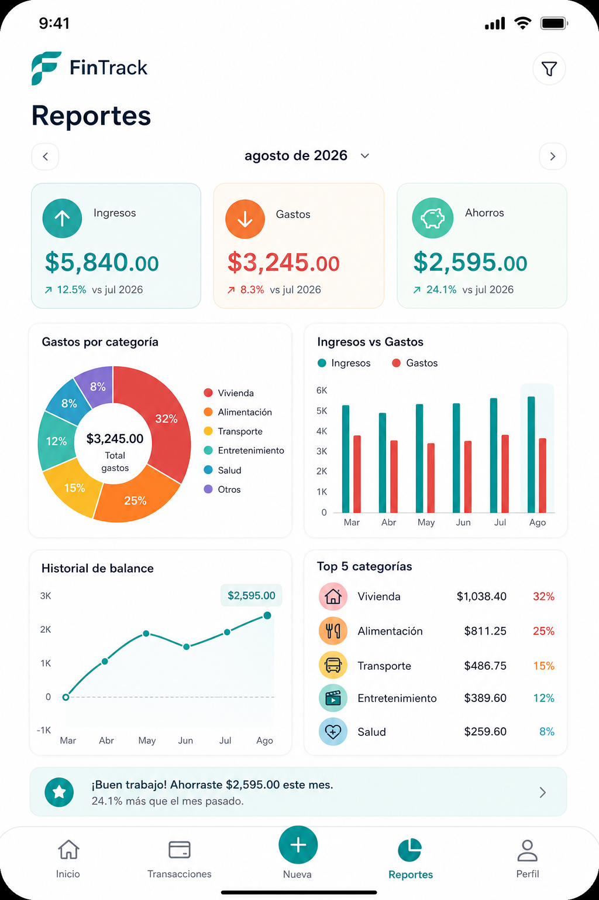
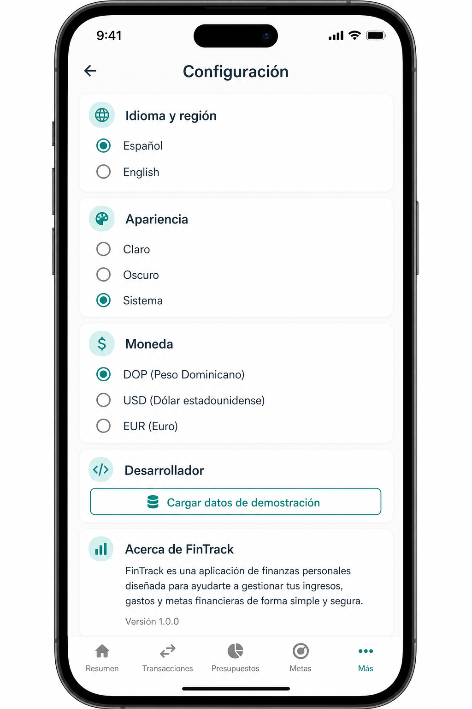
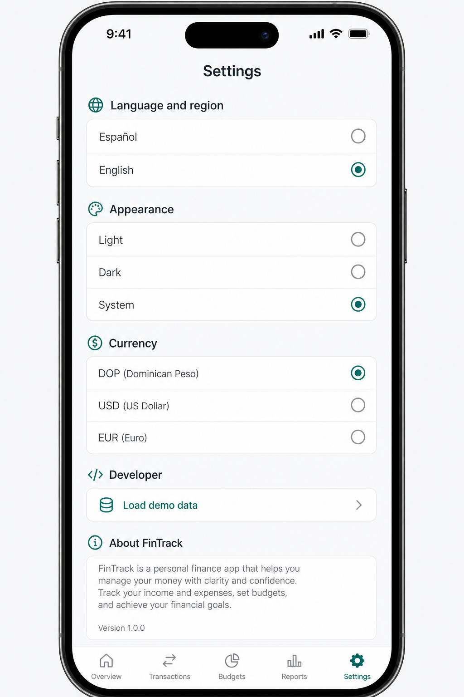

# FinTrack

A bilingual personal finance platform: a Flutter mobile app, an ASP.NET Core REST API, and PostgreSQL.

FinTrack helps people record income and expenses, stay inside monthly budgets, track savings goals, and understand spending with clear charts — in **Spanish** or **English**, switched instantly from Settings.

<p align="center">
  
  
  
</p>

---

## Overview

FinTrack is a portfolio-ready full-stack product, not a CRUD sample.

- Each user only sees their own data. Ownership always comes from the JWT, never from a client-supplied `userId`.
- Default categories are stored as stable codes (`FOOD`, `SALARY`, …) and translated in the app.
- Recurring transactions are processed by a .NET `BackgroundService` with a unique execution log so duplicates are not created.
- The UI follows Material 3, supports light / dark / system themes, and formats dates and currency with `intl`.

```text
┌──────────────────────────┐
│       Flutter App        │
│                         │
│   Español ⇄ English     │
│                         │
│ Riverpod · Dio · GoRouter│
└────────────┬─────────────┘
             │
         REST / JWT
             │
┌────────────▼─────────────┐
│       ASP.NET Core       │
│         .NET 8           │
│                         │
│     Clean Architecture   │
└────────────┬─────────────┘
             │
       Entity Framework
             │
┌────────────▼─────────────┐
│        PostgreSQL        │
│       fintrack_db        │
└──────────────────────────┘
```

## Features

- Email/password registration and login with JWT
- Profile, preferred language, preferred currency, and password change
- Income and expense tracking with categories, notes, and payment methods
- Search, filters, sorting, and pagination
- Monthly budgets per category with 80% / 100% / exceeded warnings
- Savings goals and contributions
- Recurring transactions (weekly, biweekly, monthly, yearly)
- Dashboard: balance, monthly totals, recent activity, charts
- Reports: category pie chart, income vs expenses, balance history, top 5 categories
- Local notifications (daily reminder, budget alerts, goals, upcoming recurrences)
- Spanish / English with instant language switching
- Light, dark, and system themes
- DOP / USD / EUR display (no automatic conversion)
- Development-only demo data seeder

## Screenshots

| Login | Dashboard | Transactions |
| --- | --- | --- |
|  |  |  |

| Budgets | Reports | Settings (ES) | Settings (EN) |
| --- | --- | --- | --- |
|  |  |  |  |

## Tech Stack

**Mobile**

- Flutter (stable) / Dart
- Riverpod, GoRouter, Dio
- flutter_secure_storage, shared_preferences
- fl_chart, intl, flutter_localizations, ARB
- flutter_local_notifications
- Material 3

**Backend**

- .NET 8 / ASP.NET Core Web API
- Entity Framework Core + Npgsql
- PostgreSQL
- JWT Bearer authentication
- BCrypt password hashing
- FluentValidation, AutoMapper
- Serilog
- Swagger / OpenAPI

**Infrastructure**

- Docker & Docker Compose
- EF Core migrations

## Architecture

### Backend Architecture

Clean Architecture with four projects:

```text
backend/
  FinTrack.sln
  src/
    FinTrack.Domain/          entities, enums, domain rules
    FinTrack.Application/     DTOs, validators, services, mappings
    FinTrack.Infrastructure/  EF Core, JWT, BCrypt, background jobs
    FinTrack.Api/             controllers, middleware, Swagger, DI
```

Controllers stay thin. Business rules live in Application services. Persistence and token generation live in Infrastructure. Resources are always scoped with `ICurrentUser.UserId` from JWT claims.

### Mobile Architecture

Feature-first Flutter layout:

```text
mobile/lib/
  core/           API client, theme, storage, formatters, widgets
  features/       auth, dashboard, transactions, budgets, savings,
                  reports, recurring, profile, settings
  l10n/           app_es.arb, app_en.arb
  routing/        GoRouter
  app.dart
  main.dart
```

Visible copy goes through `context.l10n`. Enums from the API (`EXPENSE`, `CREDIT_CARD`) are translated in the client.

## Getting Started

You can run the backend **with Docker** or **without Docker**. The Flutter app is the same in both cases: it talks to the API at `http://localhost:8080`.

There is no default user. Register an account first (password at least 8 characters), then log in.

---

### Option A — Run with Docker

This starts PostgreSQL and the API together. You do not need the .NET SDK.

**Prerequisites:** [Docker Desktop](https://www.docker.com/products/docker-desktop/)

```bash
cd fint
cp .env.example .env
docker compose up -d --build
```

On Windows PowerShell:

```powershell
cd C:\Users\PC\Documents\CSharp\fint
copy .env.example .env
docker compose up -d --build
```

Wait until both containers are up:

```bash
docker compose ps
```

| Service | URL |
| --- | --- |
| API | http://localhost:8080 |
| Swagger | http://localhost:8080/swagger |
| Health | http://localhost:8080/health |

The API applies EF Core migrations on startup. It does **not** recreate the database.

Useful commands:

```bash
docker compose logs -f api
docker compose stop
docker compose start
docker compose down          # keep the database volume
docker compose down -v       # also delete the database
```

Then run the Flutter app (see below).

---

### Option B — Run without Docker

This runs the .NET API on your machine. You need a local PostgreSQL install, not Docker.

**Prerequisites:**

- [.NET 8 SDK](https://dotnet.microsoft.com/download/dotnet/8.0) (the **SDK**, not only the runtime)
- [PostgreSQL 16+](https://www.postgresql.org/download/)
- Flutter 3.32+ (Dart 3.8 or newer, including 3.12.x)

Confirm the SDK is installed:

```bash
dotnet --list-sdks
```

You should see an `8.0.xxx` line.

#### 1. Create the database

Create database `fintrack_db`. Default credentials:

```text
Host:     localhost
Port:     5432
Database: fintrack_db
Username: postgres
Password: postgres
```

```bash
psql -U postgres -c "CREATE DATABASE fintrack_db;"
```

If your PostgreSQL password is not `postgres`, update `backend/src/FinTrack.Api/appsettings.Development.json`.

#### 2. Run the API

```bash
cd backend
dotnet restore
dotnet run --project src/FinTrack.Api
```

On Windows PowerShell:

```powershell
cd C:\Users\PC\Documents\CSharp\fint\backend
dotnet restore
dotnet run --project src\FinTrack.Api
```

The API listens on **http://localhost:8080**.

Migrations run automatically when the API starts. To apply them yourself:

```bash
cd backend
dotnet tool restore
dotnet ef database update --project src/FinTrack.Infrastructure --startup-project src/FinTrack.Api
```

If `dotnet restore` asks for SDK `8.0.400`, you already have a newer 8.0 SDK. Delete `backend/global.json` or set `rollForward` to `latestMajor`.

#### 3. Check tables

Connect to **`fintrack_db`** (not the default `postgres` database). You should see `users`, `categories`, `transactions`, and related tables. They stay empty until you register a user.

---

### Run the Flutter app

With the API already running (Docker or local):

```bash
cd mobile
flutter pub get
flutter run
```

API base URL is centralized in `lib/core/constants/app_config.dart`:

| Environment | URL |
| --- | --- |
| Android emulator | `http://10.0.2.2:8080/api` (default) |
| iOS simulator | `http://localhost:8080/api` |
| Physical device | `http://IP_LOCAL_PC:8080/api` via `--dart-define=API_BASE_URL=...` |
| Staging / production | `--dart-define=FLAVOR=staging` or `production` |

Physical device example:

```bash
flutter run --dart-define=API_BASE_URL=http://192.168.1.20:8080/api
```

After a first install, open **Register**, create an account, then log in. In Development, Settings includes **Load demo data**.

### Localization

- Default language: Spanish
- First launch follows the device locale (`es` or `en`). Any other device language falls back to Spanish.
- After the user picks a language in Settings, that choice is stored in `shared_preferences` and applied immediately — no restart.
- ARB files: `mobile/lib/l10n/app_es.arb` and `mobile/lib/l10n/app_en.arb`

### Environment Variables

Used by Docker Compose. Copy the example file before `docker compose up`:

```bash
cp .env.example .env
```

```text
POSTGRES_DB=fintrack_db
POSTGRES_USER=postgres
POSTGRES_PASSWORD=postgres
POSTGRES_PORT=5432

JWT_SECRET=replace-with-a-secure-secret
JWT_ISSUER=FinTrack
JWT_AUDIENCE=FinTrackMobile
JWT_EXPIRATION_MINUTES=1440
```

Never commit a real `.env` or production JWT secret.

Without Docker, the API reads `backend/src/FinTrack.Api/appsettings.Development.json` instead.

### Swagger

Open http://localhost:8080/swagger in Development.

1. Register or login through `POST /api/auth/register` or `POST /api/auth/login`.
2. Copy `accessToken`.
3. Click **Authorize** and paste the JWT (Swagger sends `Authorization: Bearer <token>`).
4. Call protected endpoints.

## Project Structure

```text
.
├── backend/
│   ├── Dockerfile
│   ├── FinTrack.sln
│   └── src/
│       ├── FinTrack.Api/
│       ├── FinTrack.Application/
│       ├── FinTrack.Domain/
│       └── FinTrack.Infrastructure/
├── mobile/                 Flutter application
├── screenshots/
├── docker-compose.yml
├── .env.example
└── README.md
```

## Demo data

In **Development**, Settings includes **Load demo data** / **Cargar datos de demostración**. It seeds sample salary, supermarket, fuel, internet, Netflix, restaurant, and freelance movements plus budgets and a savings goal so the portfolio demo looks complete.

## Roadmap

- Refresh tokens
- Biometric unlock
- Google Sign-In
- Sign in with Apple
- Firebase Cloud Messaging
- Receipt OCR
- Bank statement import
- Open banking sync
- Automatic currency conversion
- AI-assisted categories
- Expense prediction
- PDF export
- CSV export
- Web dashboard
- Shared family budgets
- Additional languages

## License

This project is provided as a portfolio sample. Adapt it freely for learning and interviews.
